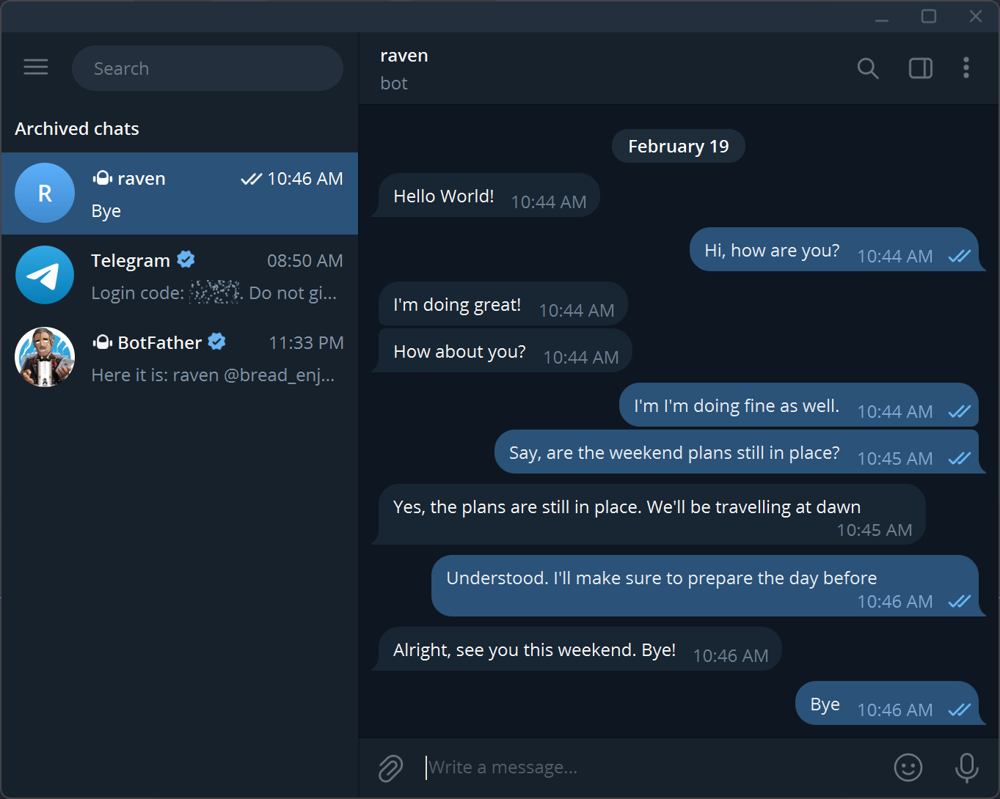
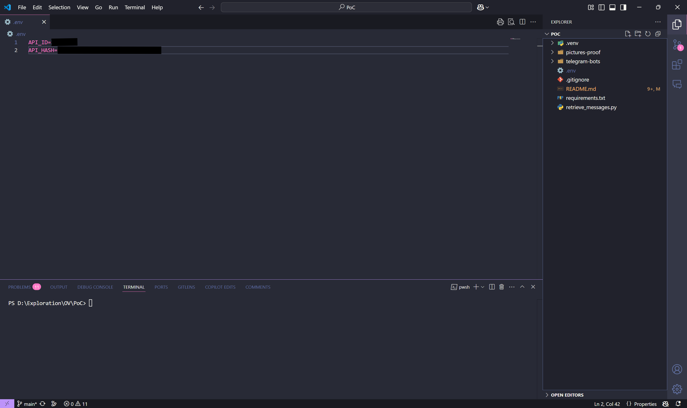
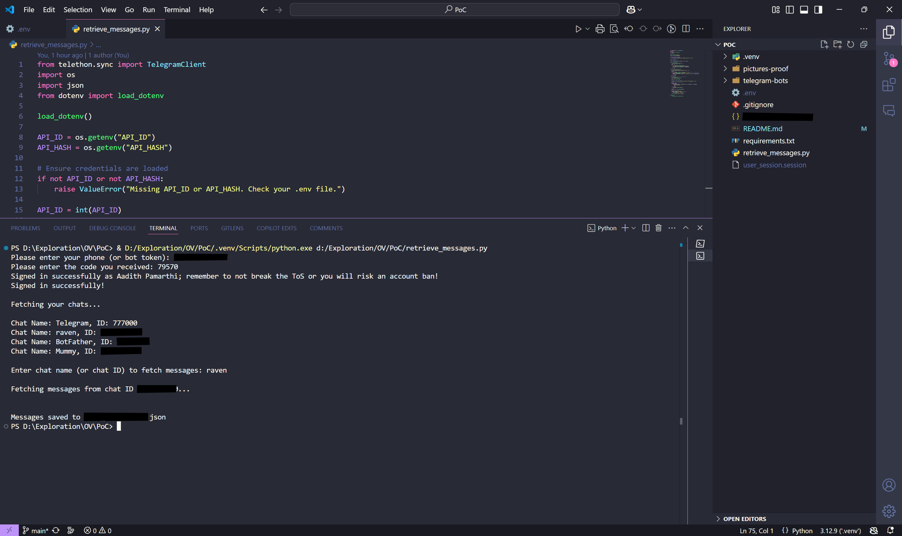
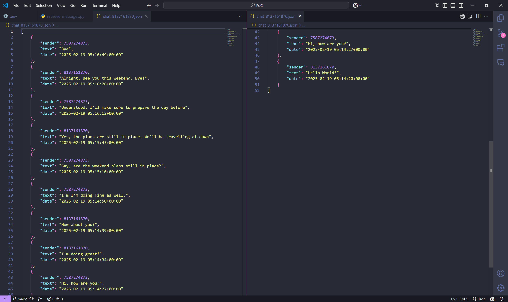

# Picture Proof of concept
___

> Telegram Chat View (Example chat with bot, program supports user chats as well)

> View of `.env` file to be created, adding `API_ID` & `API_HASH` Stored in root directory

> 1. Running the `receive_messages.py` script, which asks you for your phone number and OTP for verification. Which then creates a `user_session.session` file so that you do not need to log in every single time you run the program.
>
> 2. Entering chat name (or ID) to fetch the messages from that particular chat. And, the following chat data gets stored locally as a `<chat_id>.json` file

> The generated `.json` file showing the history of chats, arranged from newest to oldest

